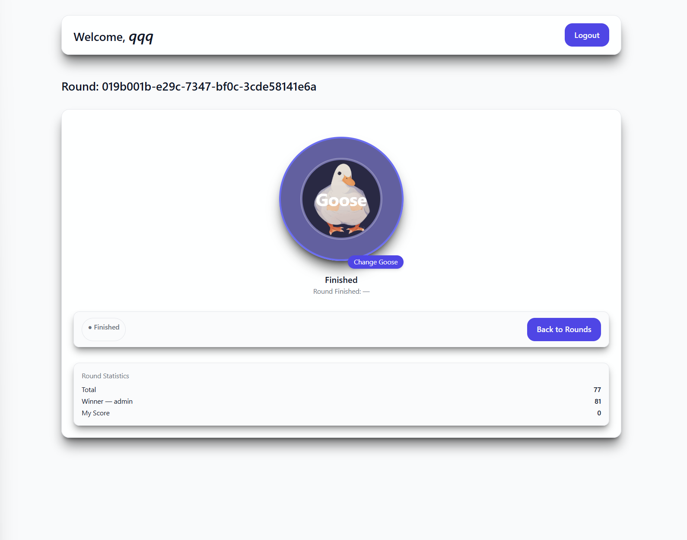
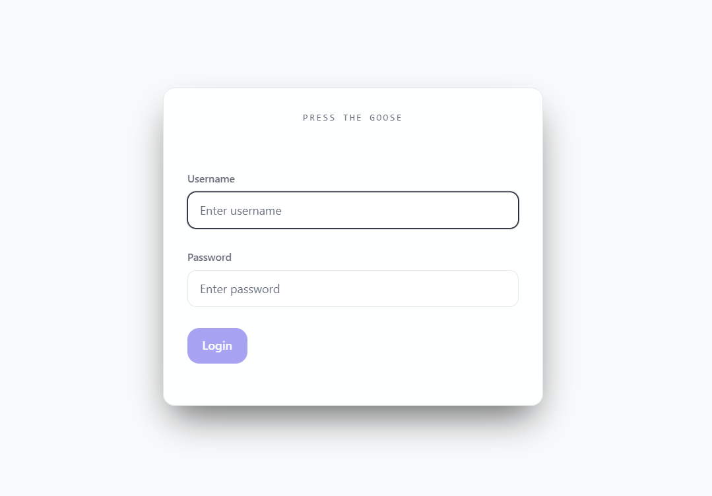

# 🦆 Goose Game 🚀 | Frontend / REACT / Zustant / TypeScript / Tailwind / Тестовое задание

### 🦆 Goose Game — Реактивная игра с раундами и "тапаньем гуся"
### 📜 Описание:
Добро пожаловать в **Goose Game** — интерактивное мини-приложение, где пользователи участвуют в игровых раундах, соревнуются за очки, "та́пают" гуся и отслеживают свою статистику в реальном времени.

Проект построен на современном фронтенд-стеке, использует **архитектуру Feature-Sliced Design**, включает авторизацию, адаптивный интерфейс и оптимизированную работу с сервером через React Query. Сделана проверка на авторизацию.

### 📜 Возможности:
Можете выбрать из списка свой раунд с гусем с тапать его. Если вы **Admin** можете создать раунд. Можно поменять гуся и посмотреть статистику. Также вы можете использовать авторизацию.

### 🥞 Tech Stack
`REACT` `Tailwind CSS` `TypeScript` `Tailwind` `React` `TanStack` `Vite` `ESLint`

### 💽 Installation & Run

1. **Установите зависимости:**

```bash
npm install
```

2. **Запустить dev-сервер:**

```bash
npm run dev
```

### 🖼️ Screenshots:



